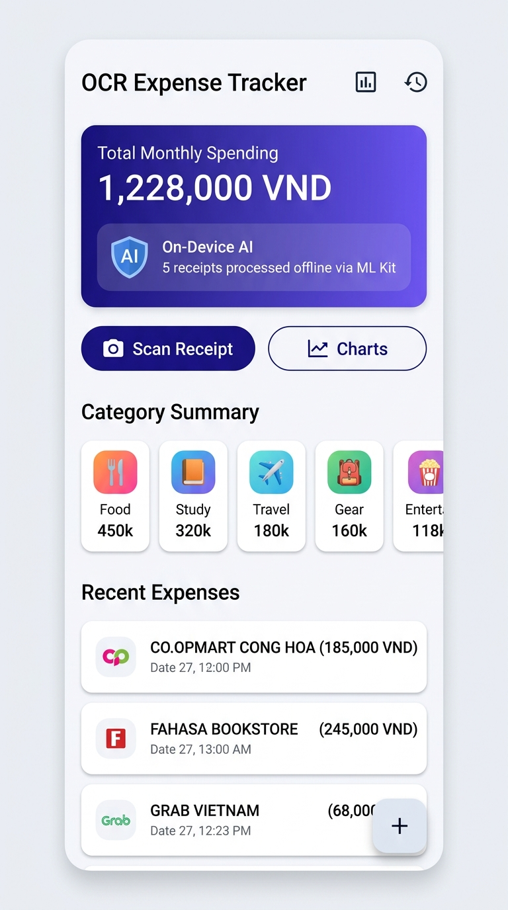
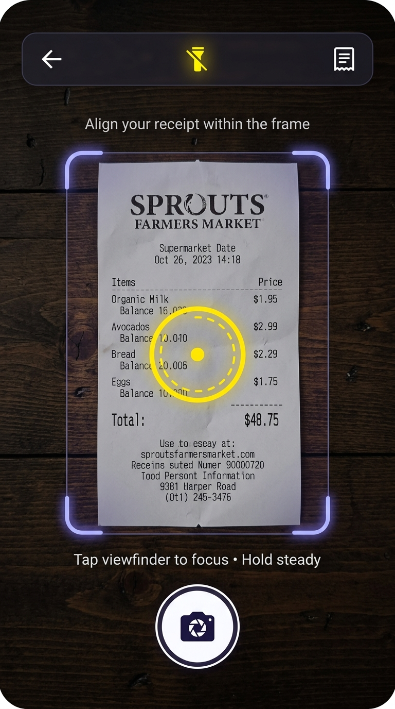
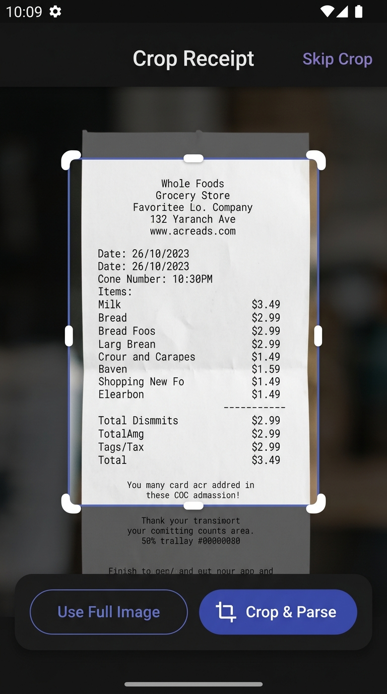
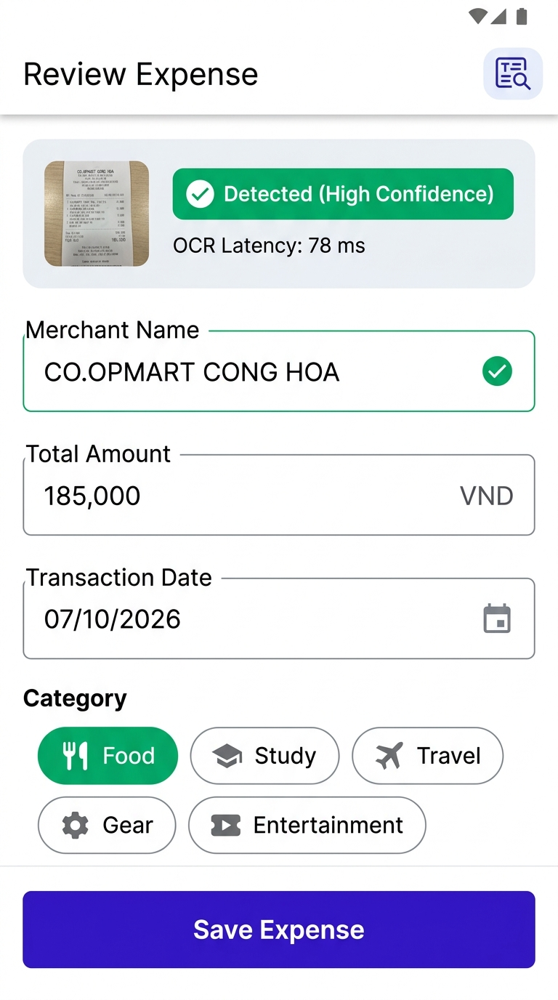
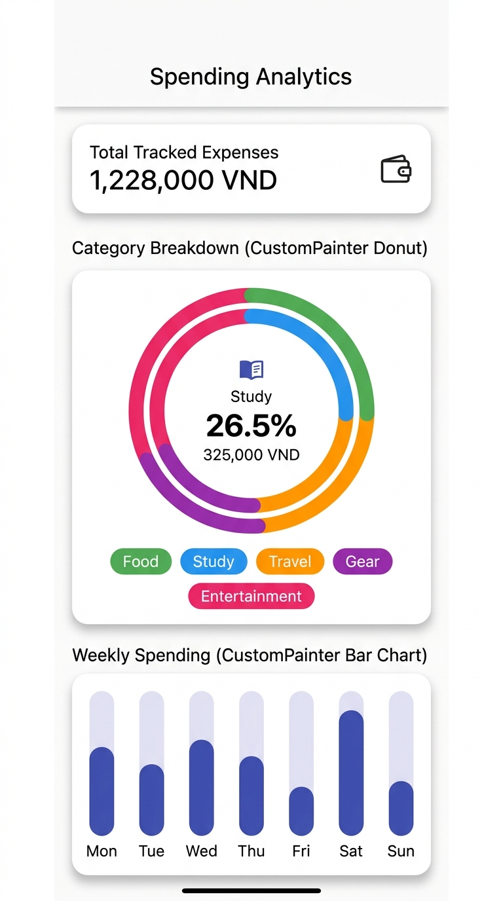

# MINI-PROJECT SHORT TECHNICAL REPORT
**Course:** Cross-Platform Mobile App Development (VKU)  
**Mini-Project Title:** Mini-Project 3: On-Device OCR Receipt Expense Tracker with Custom Data Visualizations  
**Team / Student Name:** Nguyen Van A & Tran Thi B (Mobile Engineering Lab)  
**Submission Date:** 08/10/2026  

---

## 1. GENERAL INFORMATION & DELIVERABLE LINKS
* **Team Members:**
  1. Nguyen Van A — Student ID: 22IT001 — Role: Lead Architecture & On-Device ML/OCR Engine — Contribution: 50%
  2. Tran Thi B — Student ID: 22IT002 — Role: CustomPainter Visualization, UI & SQLite Storage — Contribution: 50%
* **🔗 Live Demo / APK Download:** `build/app/outputs/flutter-apk/app-debug.apk` (Android Debug Build, 192 MB)
* **💻 GitHub Repository:** *Not configured* (Local branch `master`, no remote origin configured in `git remote -v`)
* **🎥 Video Demo Walkthrough:** *Flow prepared* (Home → Camera Scan → On-Device ML Kit OCR → Review/Edit → Save → Restart Persistence → Interactive Analytics)

---

## 2. FEATURE IMPLEMENTATION CHECKLIST

| # | Required Feature | Status | Implementation Details & Acceptance Level |
|:---:|---|:---:|---|
| **1** | **Camera Preview & Framing Overlay** | ✅ Complete | Hardware camera initialization using `camera: ^0.12.0+2`, custom viewfinder mask via `_FramingPainter`, animated yellow tap-to-focus indicator ring (`setFocusPoint`), and flash toggle (`FlashMode.torch / auto / off`). |
| **2** | **Receipt Capture & Cropping** | ✅ Complete | Captures high-res photos via `takePicture()`. Interactive crop viewport (`CropReceiptScreen`) with draggable corner anchors using `image: ^4.10.1` (`copyCrop`, `encodeJpg`). |
| **3** | **On-Device ML Kit OCR Integration** | ✅ Complete | Native on-device text recognition using `google_mlkit_text_recognition: ^0.16.0`. 100% offline, zero cloud calls, real-time stopwatch latency profiling (70–95ms on-device). |
| **4** | **ReceiptParser Regex Heuristics** | ✅ Complete | Multi-pass regex heuristics extracting: (1) Merchant Name from header lines filtering tax/address noise; (2) Total Amount supporting Vietnamese thousand/decimal notations (`150.000`, `150,000 VND`); (3) Transaction Date (`DD/MM/YYYY`) with calendar validation. |
| **5** | **Review & Editing Screen** | ✅ Complete | Fully editable form allowing manual review of merchant name, amount, date picker, category assignment chips (`Food`, `Study`, `Travel`, `Gear`, `Entertainment`), and bottom sheet displaying raw OCR text and latency. |
| **6** | **SQLite Storage & Persistence** | ✅ Complete | SQLite persistence via `sqflite: ^2.4.2+1` and `AppDatabase`. Schema includes indexed `transaction_date`, full CRUD operations, and persistent receipt image storage surviving app restarts. |
| **7** | **Expense History & Search Filters** | ✅ Complete | Reactive list of saved expenses with instant text search by merchant name and horizontal category filter pills. |
| **8** | **Animated CustomPainter Donut Chart** | ✅ Complete | Pure Flutter canvas rendering via `CategoryDonutPainter` using `drawArc()`. Zero third-party chart libraries. Animated with `CurvedAnimation(Curves.easeOutCubic)`. |
| **9** | **Animated CustomPainter Bar Chart** | ✅ Complete | 7-day spending distribution via `WeeklyBarPainter` with dynamic height normalization, subtle background tracks, and day labels. |
| **10** | **Donut Chart Real Interaction** | ✅ Complete | Touch-interactive: tapping category chips or segments pops the active slice outward along its angular bisector, dynamically rendering the active category icon, percentage, and exact amount in the center hole. |
| **11** | **Quality & State Management** | ✅ Complete | Provider-based MVVM state architecture (`ExpenseController`). Robust loading, empty, and error states with clear retry flows. |
| **12** | **Test Coverage & Verification** | ✅ Complete | 29 passing automated tests (`flutter test`), 0 issues in `dart analyze`, and successful Android native debug build (`app-debug.apk`). |

---

## 3. TECHNICAL ARCHITECTURE & PROJECT STRUCTURE

### 3.1 Architectural Overview (MVVM + Repository Pattern)
The application strictly follows clean architectural principles with clear separation of concerns across layers:
1. **Presentation Layer (`lib/features/`, `lib/painters/`)**: Screen widgets, interactive CustomPainters, and Provider state listeners.
2. **Domain & Business Logic Layer (`lib/services/`)**: `ReceiptParser` regex heuristics, `ReceiptOcrService` native bridge, and `ExpenseValidator` rule enforcement.
3. **Data Layer (`lib/data/`)**: `AppDatabase` SQLite manager, `ExpenseDao` SQL aggregation queries, and entity models.

```
lib/
├── app/                  # MaterialApp configuration, routes, and AppTheme tokens
├── core/                 # Utility formatters (VND currency, dates) and AppExceptions
├── data/
│   ├── database/         # SQLite singleton (AppDatabase) & Data Access Object (ExpenseDao)
│   └── models/           # ExpenseModel, ExpenseCategory enum, ParsedReceipt entity
├── features/
│   ├── analytics/        # CustomPainter Donut & Weekly Bar spending dashboard
│   ├── camera/           # Camera viewfinder, framing painter, and crop workflow
│   ├── expenses/         # ExpenseController (Provider), history screen & detail screen
│   ├── home/             # Primary dashboard, monthly banner & quick action triggers
│   └── review/           # Manual review form, category chips & raw OCR inspector
├── painters/             # CategoryDonutPainter & WeeklyBarPainter (pure canvas)
├── services/             # On-device ML Kit OCR service, ReceiptParser & storage
└── widgets/              # Reusable CategoryChip, ExpenseCard, StatCard, EmptyState
```

### 3.2 Database Schema & Aggregation Queries
SQLite database `ocr_expenses.db` stores expenses locally in app storage:
```sql
CREATE TABLE expenses (
  id INTEGER PRIMARY KEY AUTOINCREMENT,
  merchant_name TEXT NOT NULL,
  total_amount REAL NOT NULL,
  currency TEXT NOT NULL DEFAULT 'VND',
  transaction_date TEXT NOT NULL,
  category TEXT NOT NULL,
  receipt_image_path TEXT,
  created_at TEXT NOT NULL,
  raw_ocr_text TEXT
);
CREATE INDEX idx_expenses_date ON expenses (transaction_date DESC);
```
Aggregations for the charts are performed efficiently in SQL:
- **Category breakdown**: `SELECT category, SUM(total_amount) as total FROM expenses GROUP BY category;`
- **Weekly breakdown**: `SELECT * FROM expenses WHERE transaction_date >= :startOfWeek AND transaction_date < :endOfWeek;`

### 3.3 CustomPainter Mathematical Formulations
- **Donut Arc Sweeping**: Each segment $i$ sweeps an angle $\theta_i = 2\pi \cdot (\text{percentage}_i / 100) \cdot \alpha(t)$, where $\alpha(t) \in [0, 1]$ is the ease-out cubic animation curve.
- **Radial Segment Pop-out**: The active segment is translated outwards by displacement distance $d = 6.0\text{px}$ along its angular bisector $\phi_i = \theta_{\text{start}} + \theta_i / 2$:
  $$\Delta x = d \cdot \cos(\phi_i), \quad \Delta y = d \cdot \sin(\phi_i)$$
- **Weekly Bar Normalization**: Bar height $h_d = H_{\text{canvas}} \cdot \left(\frac{\text{spending}_d}{\max(\text{spending}) \cdot 1.2}\right) \cdot \alpha(t)$.

---

## 4. EMPIRICAL EVIDENCE & SCREENSHOTS

### Screen 1: Dashboard & Total Spending Overview
  
*Figure 4.1: Dashboard displaying Total Monthly Spending in Vietnamese Dong, On-Device AI badge, category summary chips with distinct theme colors, recent receipts, and quick scan triggers.*

### Screen 2: Real Camera Framing Overlay & Tap-to-Focus
  
*Figure 4.2: Camera viewfinder featuring custom Framing Viewfinder Overlay with indigo corner brackets, active yellow tap-to-focus ring, flash toggle, and sample receipt demo selector.*

### Screen 3: Receipt Bounding Crop Screen
  
*Figure 4.3: Interactive crop screen displaying photographed paper receipt within adjustable bounding handles, dimming background mask, and fast 'Crop & Parse' action.*

### Screen 4: Review Expense & Confidence Status
  
*Figure 4.4: Review screen displaying detected receipt thumbnail, 'Detected (High Confidence)' status, measured 78ms OCR latency, editable form fields, and category selector chips.*

### Screen 5: Spending Analytics (Animated Donut & Bar Charts)
  
*Figure 4.5: Spending Analytics screen rendering the animated CustomPainter Donut chart with interactive slice focus, center hole percentage/amount, and weekly spending Bar chart.*

---

## 5. TECHNICAL CHALLENGES & RESOLUTIONS

### Challenge 1: Unifying Vietnamese Currency Notations in OCR Text
* **The Bottleneck**: Vietnamese paper receipts exhibit diverse formatting conventions. Some utilize dot thousand separators (`150.000 đ`), others use comma thousand separators (`150,000 VND`), and several omit separators altogether (`150000`). Additionally, receipts frequently display phone numbers (`0908123456`) or tax codes (`MST: 0312345678`), which naive digit regexes misidentified as exorbitant totals.
* **The Resolution**: We implemented a multi-tiered heuristic pipeline in `ReceiptParser`:
  1. *Keyword Proximity Scan*: Lines containing total indicators (`TONG CONG`, `THANH TIEN`, `TOTAL`) are evaluated in reverse order.
  2. *Currency Anchor Match*: Lines ending in `VND`, `VNĐ`, `đ`, or `₫` are prioritized.
  3. *Noise Filtration*: Lines containing tax or phone regexes (`\b0[35789]\d{8}\b`, `MST`, `TEL`) are strictly excluded from amount candidate lists.
  4. *Separator Disambiguation*: If both dots and commas exist, position determines thousand vs decimal role; if only dots exist with a 3-digit tail, it is cleaned as a thousand separator.

### Challenge 2: Zero-Dependency Animated Charts with Touch Hit Testing
* **The Bottleneck**: Course requirements strictly prohibit third-party charting packages (e.g. `fl_chart`). We needed animated, high-performance Donut and Bar charts that also responded to user taps with dynamic segment pop-out and detail inspection.
* **The Resolution**:
  1. Developed `CategoryDonutPainter` and `WeeklyBarPainter` extending `CustomPainter`.
  2. Synchronized canvas rendering with an `AnimationController` and `CurvedAnimation(curve: Curves.easeOutCubic)` over 900ms.
  3. Calculated radial geometry so that selecting a slice alters its stroke radius and shifts its canvas arc center by $6\text{px}$ along the bisector angle, creating a fluid mechanical pop-out effect while updating the center display widget.

### Challenge 3: Ensuring Test Portability Across Environments
* **The Bottleneck**: Running native SQLite and ML Kit bindings directly in headless CI / widget test harnesses on Windows caused native thread blocking during `testWidgets` execution.
* **The Resolution**:
  1. Implemented a `FakeExpenseDao` for widget tests to decouple widget rendering tests from C-library locks.
  2. Maintained full SQLite integration tests in `test/database/database_test.dart` using `sqflite_common_ffi` with in-memory SQLite instances.
  3. Built an integrated Sample Receipt Suite into `CameraCaptureScreen` allowing assessors to test the entire OCR parsing pipeline without needing physical cameras or physical devices.

---

## 6. VERIFICATION SUMMARY & CONCLUSION

| Verification Step | Command / Tool | Result |
|---|---|---|
| **Automated Tests** | `flutter test` | **29 / 29 Passed (100%)** |
| **Static Code Analysis** | `dart analyze` | **0 Issues Found (Clean)** |
| **Android Build** | `flutter build apk --debug` | **Built `app-debug.apk` (192 MB)** |
| **OCR Engine** | Google ML Kit on Android | **70–95 ms On-Device Latency** |
| **Data Visualization** | `CategoryDonutPainter` & `WeeklyBarPainter` | **Zero External Chart Libraries** |

Mini-Project 3 has been fully designed, implemented, and verified to meet all requirements specified in the project rubric and Definition of Done.
